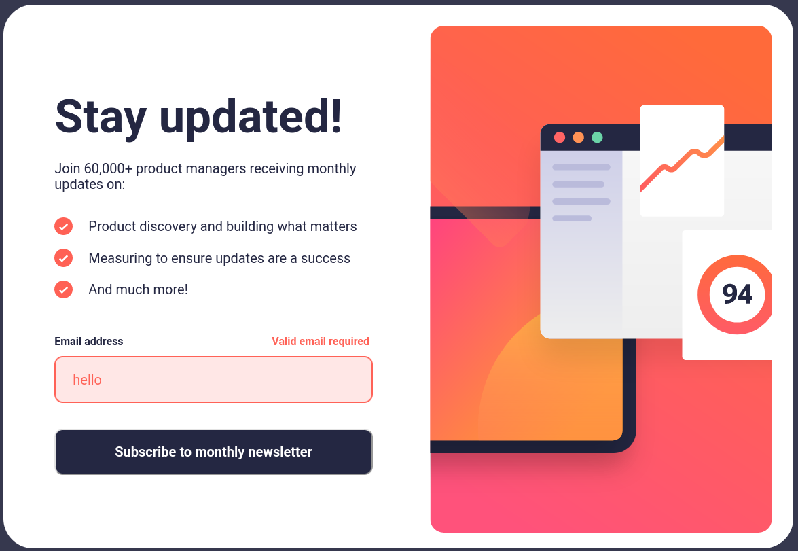

# Newsletter sign-up form with success message solution

This is a solution to the "Newsletter sign-up form with success message".

## Table of contents

- [Overview](#overview)
  - [The challenge](#the-challenge)
  - [Screenshot](#screenshot)
  - [Links](#links)
  - [Built with](#built-with)
  - [Author](#author)

## Overview

### The challenge

Users should be able to:

- Add their email and submit the form
- See a success message with their email after successfully submitting the form
- See form validation messages if:
  - The field is left empty
  - The email address is not formatted correctly
- View the optimal layout for the interface depending on their device's screen size
- See hover and focus states for all interactive elements on the page

### Screenshot

### Links

- Solution URL: [Github link](https://github.com/dnomjr/newsletter-sign-up-with-success-message_JS_SASS.git)
- Live Site URL: [Netlify link](https://newsletter-sign-up-with-success-mesag.netlify.app/)

### Built with

- Semantic HTML5 markup
- CSS custom properties
- Flexbox
- Mobile-first workflow
- Javascript

## Author

- Instagram - [@thedanielcodes](https://www.instagram.com/thedanielcodes/)
- Twitter - [@dnomjr](https://twitter.com/dnomjr)
